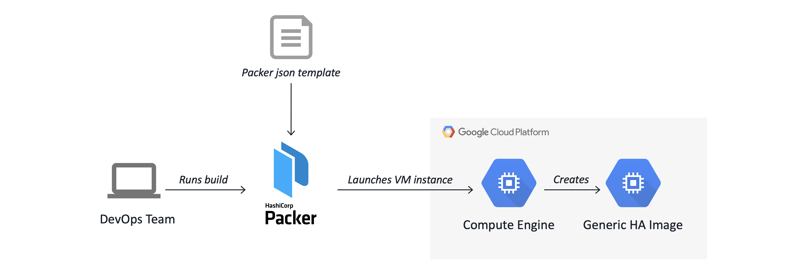
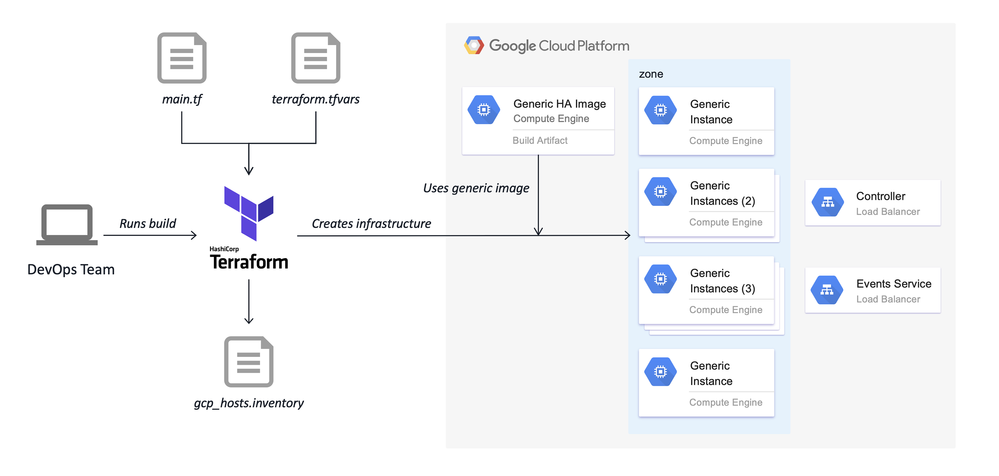
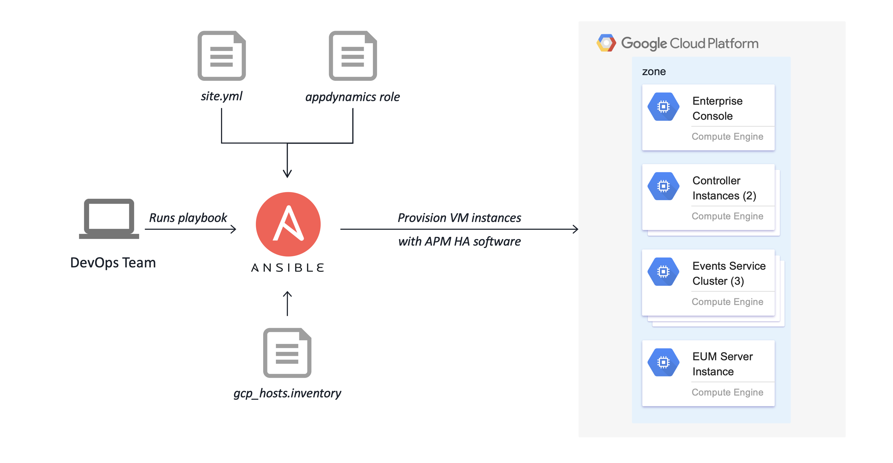

# AppD Cloud Platform

The AppDynamics Cloud Platform is a DevOps project to help automate the deployment of an HA configuration
of the AppDynamics Platform in the cloud using the on-premise installers. It consists of a code repository
with Infrastructure as Code (IaC) artifacts, software provisioning modules, and a runbook with step-by-step
instructions for deploying the platform on Amazon AWS and the Google Cloud Platform (GCP).

It is based on the concepts of Immutable Infrastructure and Idempotent provisioning.

## Overview

When installing the AppDynamics Platform software, the provisioning and configuration of an on-premise HA
installation is an extremely tedious and time-consuming challenge for IT administrators. The purpose of this
project is to significantly reduce the time required for these installation activities using __Packer__,
__Terraform__, and __Ansible__.

Here is an example of the deployment architecture when deployed to the Google Cloud Platform:  

__AppD Cloud Platform: HA Deployment on GCP__


## Build and Deployment Concepts

Although there are many tools available to accomplish the automation goals of this project, it was decided
to standardize on the open source tools referenced above. This is primarily due to their capability for
building and deploying software platforms to multi-cloud environments, as well as having a high level of
adoption within the developer community.

### Packer

[Packer](https://packer.io/) is an open source tool for creating identical machine images for multiple platforms
from a single source configuration. Packer is lightweight, runs on every major operating system, and is highly
performant. A machine image (or immutable VM image) is a single static unit that contains a pre-configured
operating system and installed software which is used to quickly create new running machines.  

As part of this project, Packer is used to create a public immutable VM image for the HA platform consisting of
a standardized installation of CentOS 7.9 along with a set of common tools (scripts, playbooks, JDK, etc.).  

This public VM image is maintained by AppDynamics with new images released monthly. However, all of the artifacts
used to build the image are present in this project, so customers are free to customize and build their own VM
image if desired.  

__Packer Build Flow for GCP__


### Terraform

[Terraform](https://terraform.io/) is a tool for building, changing, and versioning infrastructure safely and
efficiently. Terraform can manage existing and popular service providers as well as custom in-house solutions.
The infrastructure Terraform can manage includes low-level components such as compute instances, storage, and
networking, as well as high-level components such as DNS entries, SaaS features, etc.  

In this project, Terraform automates the deployment of the HA Platform infrastructure, including VPCs, subnets,
security groups, load balancers, and VMs.  

__Terraform Build Flow for GCP__


### Ansible

[Ansible](https://ansible.com/) is a simple IT automation engine that automates cloud provisioning, configuration
management, application deployment, and intra-service orchestration. It uses no agents and no additional custom
security infrastructure, so it's easy to deploy--and most importantly, it uses a very simple language (YAML, in
the form of Ansible Playbooks) that allow you to describe your automation jobs in a way that approaches plain
English.  

Although Ansible has the capability to deploy infrastructure, in this project a conscious decision was made to
leave those tasks to Terraform. Ansible is used solely for provisioning the VMs. These tasks include prepping,
installing, and configuring the HA Platform on the running VMs.  

__Ansible Provisioning Flow for GCP__


## Get Started

To deploy the AppDynamics Cloud Platform, the first step is to set-up your local environment by installing the
needed open source software.

### Prerequisites
You install Packer, Terraform, and Ansible on a control node, (usually your local laptop,) which then uses the
cloud provider CLI and/or SSH to communicate with your cloud resources and managed nodes.  

__NOTE:__ Ansible installations can be run from any machine with Python 2 (version 2.7) or Python 3
(versions 3.5 and higher) installed. This includes Red Hat, Debian, CentOS, macOS, any of the BSDs, and
so on. *However, __Windows__ is NOT currently supported for the Ansible control node.*

## Installation Instructions - macOS

The following open source software needs to be installed on the host macOS machine:

-	Homebrew 3.0.1
-	Git 2.30.1
-	Packer 1.7.0
-	Terraform 0.14.7
-	Ansible 2.10.7

Perform the following steps to install the needed software:

1.	Install the [Homebrew 3.0.1](https://brew.sh/) package manager for macOS 64-bit. Paste the following into a macOS Terminal prompt:  
    ```bash
    $ /bin/bash -c "$(curl -fsSL https://raw.githubusercontent.com/Homebrew/install/master/install.sh)"
    ```

2.	Install [Git 2.30.1](https://git-scm.com/downloads) for macOS 64-bit.  
    ```bash
    $ brew install git
    ```

3.	Install [Packer 1.7.0](https://www.packer.io/downloads.html) for macOS 64-bit.  
    ```bash
    $ brew tap hashicorp/tap
    $ brew install hashicorp/tap/packer
    ```

4.	Install [Terraform 0.14.7](https://www.terraform.io/downloads.html) for macOS 64-bit.  
    ```bash
    $ brew tap hashicorp/tap
    $ brew install hashicorp/tap/terraform
    ```

5.	Install [Ansible 2.10.7](https://ansible.com/) for macOS 64-bit.  
    ```bash
    $ brew install ansible
    ```

## Configuration and Validation - macOS

1.	Validate installed command-line tools:

    ```bash
    $ brew --version
    Homebrew 3.0.1

    $ git --version
    git version 2.30.1

    $ packer --version
    1.7.0

    $ terraform --version
    Terraform v0.14.7

    $ ansible --version
    ansible 2.10.7
    ...
    ```

2.	Configure Git for local user:

    ```bash
    $ git config --global user.name "<first_name> <last_name>"
    $ git config --global user.email "<your_email>"
    $ git config --global --list
    ```

## Get the Code

1.	Create a folder for your AppD Cloud Platform project:

    ```bash
    $ mkdir -p ~/projects
    $ cd ~/projects
    ```

2.	Get the code from GitHub:

    ```bash
    $ git clone https://github.com/Appdynamics/AppD-Cloud-Platform.git
    $ cd AppD-Cloud-Platform
    ```

## Deploy the AppDynamics Cloud Platform

The AppDynamics Cloud Platform project currently supports deployment to AWS and GCP. In the future, we will
be adding support for Microsoft Azure. Click on a link below for specific cloud-provider instructions and
Bill-of-Materials:

-	[AWS Deployment Instructions](./docs/AWS_DEPLOYMENT_INSTRUCTIONS.md)
-	[GCP Deployment Instructions](./docs/GCP_DEPLOYMENT_INSTRUCTIONS.md)
